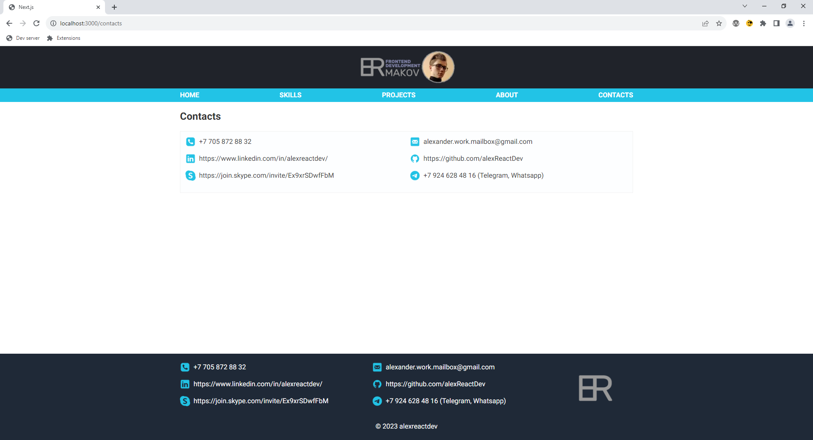

# My personal website
## :uk: English
__Description:__ Personal website with all information about my skills and projects

__Deployed project:__ http://alexander-portfolio-and-cv.com

__Used technologies:__

- Typescript
- React
- React hooks
- React server components
- Next.js (app router)
- Tailwind
- Adaptive-responsive design
- Flex layout
- Formik
- Swiper
- Axios
- SWR
- PostgreSQL

__About project:__ Personal website with landing home page. This website contains all information about my projects with filtering by applied technologies. Also includes full list of technologies I know with scope filters (frontend, backend e.t.c.). Website made via Next.js. TailwindCSS was used for styling. All styles are made in adaptive-responsive manner. Next.js was also used for creating api (route.ts) and PostgreSQL was used as data storage.

## :ru: Русский
__Описание:__ Сайт-визитка с информацией о моих навыках и проектах

__Развернутый проект:__ http://alexander-portfolio-and-cv.com

__Использованные технологии:__

- Typescript
- React
- React hooks
- React server components
- Next.js (app router)
- Tailwind
- Adaptive-responsive design
- Formik
- Swiper
- Axios
- SWR
- PostgreSQL

 

__О проекте:__ Персональный сайт с домашней страницей в виде лендинга. Сайт содержит полную информацию о моих проектах с возможностью фильтрации по примененным технологиям, а так же полный список технологий которыми я владею, с возможностью фильтрации по категориям (фронтенд, бэкенд и.т.д.). Сайт сделан на Next.js. Для создания стилей использован TailwindCSS, весь сайт выполнен в адаптивно-отзывчивом стиле. Для создания api так же использован next (route.ts). Для хранения данных используется реляционная БД PostgreSQL.

 

## Preview/Превью

