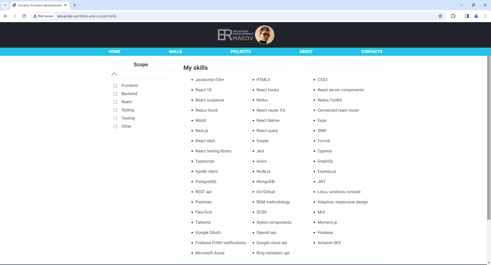

# My personal website
__Description:__ Personal website with all information about me and my projects

__Deployed project:__ http://alexander-portfolio-and-cv.com

__Used technologies:__

- Typescript
- React
- React hooks
- React server components
- Next.js (app router)
- Tailwind
- Adaptive-responsive design
- Flex layout
- Formik
- Swiper
- Axios
- SWR
- PostgreSQL

 

__About project:__ Personal website with all information about me, my projects and skills. Includes full list of technologies I use with scope filters (frontend, backend e.t.c.) and full list of my projects (you can use filters as well in order to filter by technologies you're interested in). You can find contact information in contacts section.

 

 The website is made via Next.js 13 and Tailwind CSS (for styling). All styles are adaptive-responsive, so you can use it on your phone as well as on your computer. Backend written via Next.js too (route functions) and PostgreSQL serves as a database. The website also has admin page, that makes it even more convenient to use.

 

## Preview

